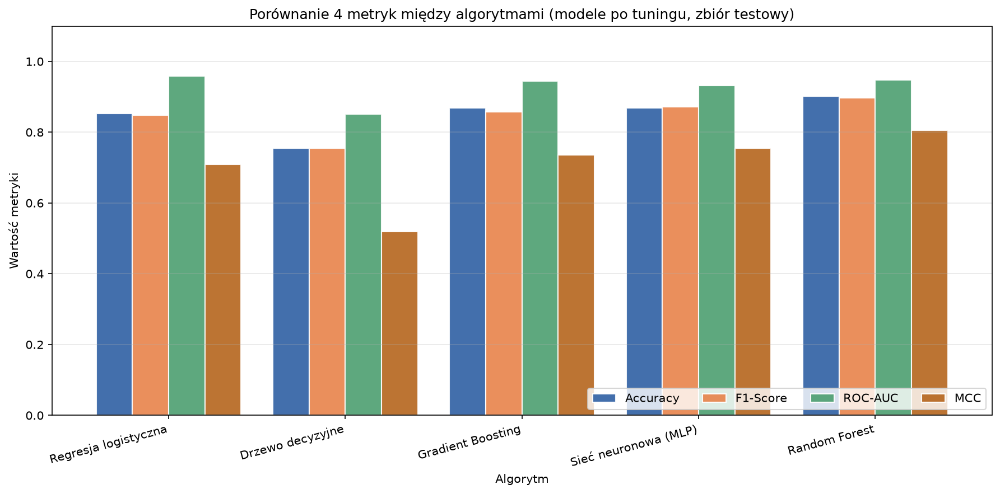
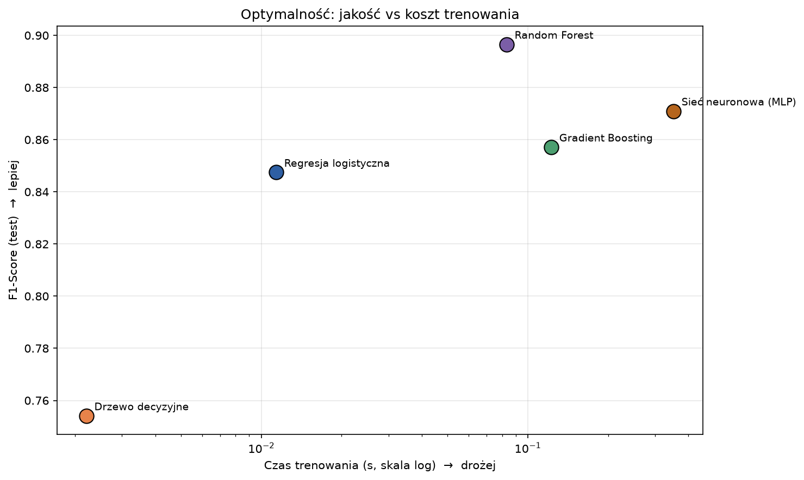

# Uczenie Maszynowe – Projekt: Las Losowy (Random Forest)

---

## Spis treści

1. [Opis projektu](#1-opis-projektu)
2. [Zbiór danych](#2-zbiór-danych)
3. [Struktura repozytorium](#3-struktura-repozytorium)
4. [Plan realizacji](#4-plan-realizacji)
5. [Metryki oceny modelu](#5-metryki-oceny-modelu)
6. [Technologie](#6-technologie)
7. [Jak uruchomić](#7-jak-uruchomić)
8. [Wyniki](#8-wyniki)

---

## 1. Opis projektu

Projekt polega na zbudowaniu klasyfikatora binarnego do **przewidywania choroby serca** u pacjentów.

**Cel:** Przewidzieć, czy pacjent ma chorobę serca (`1`) czy nie (`0`) na podstawie danych klinicznych.

---

## 2. Zbiór danych

**Dataset:** [Heart Disease UCI](https://archive.ics.uci.edu/dataset/45/heart+disease) – zbiór Cleveland z repozytorium UCI Machine Learning Repository.

| Właściwość       | Wartość                         |
|------------------|---------------------------------|
| Liczba próbek    | 303                             |
| Liczba cech      | 13 cech wejściowych             |
| Zmienna docelowa | `target` – 0 (brak) / 1 (choroba) |
| Typ problemu     | Klasyfikacja binarna            |

**Cechy (features):**

| Cecha      | Opis                                          | Typ       |
|------------|-----------------------------------------------|-----------|
| `age`      | Wiek pacjenta                                 | numeryczna |
| `sex`      | Płeć (0 = kobieta, 1 = mężczyzna)            | kategoryczna |
| `cp`       | Typ bólu w klatce piersiowej (0–3)            | kategoryczna |
| `trestbps` | Ciśnienie krwi w spoczynku [mm Hg]            | numeryczna |
| `chol`     | Poziom cholesterolu [mg/dl]                   | numeryczna |
| `fbs`      | Cukier na czczo > 120 mg/dl (0/1)             | kategoryczna |
| `restecg`  | Wyniki EKG w spoczynku (0–2)                  | kategoryczna |
| `thalach`  | Maksymalne tętno                              | numeryczna |
| `exang`    | Dławica wywołana wysiłkiem (0/1)              | kategoryczna |
| `oldpeak`  | Obniżenie ST (wysiłek vs spoczynek)           | numeryczna |
| `slope`    | Nachylenie segmentu ST (0–2)                  | kategoryczna |
| `ca`       | Liczba naczyń (0–3) w fluoroskopii            | numeryczna |
| `thal`     | Wynik testu talusowego (0–3)                  | kategoryczna |

---

## 3. Metryki oceny modelu

Poza **accuracy** używamy trzech metryk, które lepiej opisują jakość klasyfikatora – szczególnie przy niezbalansowanych klasach:

---

### Metryka 1: F1-Score

**Wzór:**

$$F1 = 2 \cdot \frac{\text{Precision} \times \text{Recall}}{\text{Precision} + \text{Recall}}$$

**Dlaczego?** F1-Score jest harmoniczną średnią precyzji i czułości. Karze mocno za zarówno fałszywe pozytywy, jak i fałszywe negatywy. W diagnozie medycznej kluczowe jest wykrycie **wszystkich chorych** (wysoki Recall) i nie diagnozowanie zdrowych jako chorych (wysoka Precision) – F1 balansuje oba aspekty.

**Interpretacja:** Wartość od 0 do 1. Im bliżej 1, tym lepiej.

```python
from sklearn.metrics import f1_score
f1 = f1_score(y_test, y_pred)
```

---

### Metryka 2: ROC-AUC (Area Under the ROC Curve)

**Opis:** ROC-AUC mierzy zdolność modelu do **odróżniania klas** przy różnych progach klasyfikacji. Krzywa ROC pokazuje stosunek TPR (czułość) do FPR (1 - specyficzność).

**Wzór AUC:** Pole pod krzywą ROC (całkowane po trapezy).

**Dlaczego?** AUC jest odporne na niezbalansowanie klas i mierzy ogólną zdolność dyskryminacyjną modelu – nie zależy od konkretnego progu 0.5.

**Interpretacja:**
- AUC = 0.5 → model losowy
- AUC = 1.0 → model doskonały
- AUC ≥ 0.8 → dobra jakość modelu

```python
from sklearn.metrics import roc_auc_score
auc = roc_auc_score(y_test, model.predict_proba(X_test)[:, 1])
```

---

### Metryka 3: Matthews Correlation Coefficient (MCC)

**Wzór:**

$$MCC = \frac{TP \cdot TN - FP \cdot FN}{\sqrt{(TP+FP)(TP+FN)(TN+FP)(TN+FN)}}$$

**Dlaczego?** MCC jest uważany za jedną z najlepszych pojedynczych metryk dla klasyfikacji binarnej – uwzględnia **wszystkie cztery komórki macierzy pomyłek** (TP, TN, FP, FN). Jest szczególnie cenny przy niezbalansowanych zbiorach danych. W przeciwieństwie do accuracy, nie jest mylący gdy klasy są nierówne.

**Interpretacja:**
- MCC = -1 → model odwrotny (zawsze się myli)
- MCC = 0 → predykcja losowa
- MCC = +1 → model doskonały

```python
from sklearn.metrics import matthews_corrcoef
mcc = matthews_corrcoef(y_test, y_pred)
```

---

### Podsumowanie metryk

| Metryka        | Zakres  | Zaleta                                    |
|----------------|---------|-------------------------------------------|
| **Accuracy**   | [0, 1]  | Prosta interpretacja                      |
| **F1-Score**   | [0, 1]  | Balans Precision/Recall                   |
| **ROC-AUC**    | [0, 1]  | Niezależna od progu, odporna na imbalance |
| **MCC**        | [-1, 1] | Uwzględnia wszystkie komórki CM           |

---

## 4. Technologie

| Biblioteka       | Wersja      | Zastosowanie                        |
|------------------|-------------|-------------------------------------|
| Python           | ≥ 3.10      | Język programowania                 |
| pandas           | ≥ 2.0       | Manipulacja danymi                  |
| numpy            | ≥ 1.24      | Operacje numeryczne                 |
| scikit-learn     | ≥ 1.3       | Model RF, metryki, walidacja        |
| matplotlib       | ≥ 3.7       | Podstawowe wykresy                  |
| seaborn          | ≥ 0.12      | Estetyczne wizualizacje             |
| jupyter          | ≥ 1.0       | Notebooki                           |

---

## 5. Jak uruchomić

### Instalacja zależności

```bash
pip install -r requirements.txt
```

### Uruchomienie głównego skryptu

```bash
python main.py
```

### Uruchomienie notebooków

```bash
jupyter notebook notebooks/
```

Uruchamiać od 01 do 07.

---

## 6. Wyniki

Wyniki znajdują się w notebook'u nr 07 - `07_summary_comparision.ipynb`


## 7. Porównanie algorytmów

Zaimplementowano **pięć algorytmów** (każdy w osobnym notebooku, w tym samym stylu i na tym samym datasecie) oraz **notebook zbiorczy** porównujący wszystkie pięć. Cel: pokazać różnice w jakości, czasie trenowania i zachowaniu przy małym zbiorze.

| Notebook | Algorytm |
|----------|----------|
| `notebooks/02_model_training.ipynb` | Las losowy |
| `notebooks/03_logistic_regression.ipynb` | Regresja logistyczna |
| `notebooks/04_decision_tree.ipynb` | Drzewo decyzyjne |
| `notebooks/05_gradient_boosting.ipynb` | Gradient Boosting |
| `notebooks/06_neural_network.ipynb` | Prosta sieć neuronowa (MLP) |
| `notebooks/07_summary_comparison.ipynb` | **Porównanie zbiorcze** (5 algorytmów) |

Wspólny kod (buildery modeli, siatki hiperparametrów, ewaluacja, zapis wyników) mieszka w `src/algorithms.py` - dzięki temu wszystkie notebooki używają **identycznych** definicji modeli i tego samego splitu 80/20. Każdy model jest strojony `GridSearchCV` (5-fold, `scoring='f1'`) i zapisuje metryki do `results/<algorytm>.json`, z których korzysta notebook zbiorczy. Liczone są **te same 4 metryki**: Accuracy, F1-Score, ROC-AUC, MCC.

### Wyniki porównania (modele po tuningu, zbiór testowy)

| Algorytm | Accuracy | F1-Score | ROC-AUC | MCC | Czas treningu |
|----------|:--------:|:--------:|:-------:|:---:|:-------------:|
| Random Forest | **0.9016** | **0.8966** | 0.9481 | **0.8048** | ~51 ms |
| Sieć neuronowa (MLP) | 0.8689 | 0.8710 | 0.9318 | 0.7546 | ~228 ms |
| Gradient Boosting | 0.8689 | 0.8571 | 0.9448 | 0.7359 | ~67 ms |
| Regresja logistyczna | 0.8525 | 0.8475 | **0.9578** | 0.7087 | ~4 ms |
| Drzewo decyzyjne | 0.7541 | 0.7541 | 0.8517 | 0.5184 | ~1 ms |



**Wnioski (skrót - pełne w notebooku `07`):**
- **Jakość:** Random Forest ma najlepszy ranking łączny; regresja logistyczna — najlepsze ROC-AUC. Drzewo decyzyjne wyraźnie odstaje we wszystkich metrykach.
- **Czas trenowania:** rozpiętość ~2 rzędów wielkości — drzewo i regresja w milisekundach, RF i Gradient Boosting kilkadziesiąt razy wolniej, MLP najwolniejszy (~200× wolniej od drzewa).
- **Mały zbiór:** Gradient Boosting jest najbardziej „głodny danych"; regresja logistyczna i RF najlepiej wykorzystują pełny zbiór.
- **Optymalność:** regresja logistyczna leży blisko frontu jakość/koszt - dobra rekomendacja dla tego problemu (mały, tabelaryczny, wymagana interpretowalność).



---

## Autorzy
- Oskar Chrostowski
- Kajetan Mieloch
- Kacper Wiszniewski
- Michał Nowakowski
- Paweł Szydłowski

Projekt realizowany w ramach przedmiotu **Uczenie Maszynowe** na studiach WSB Merito