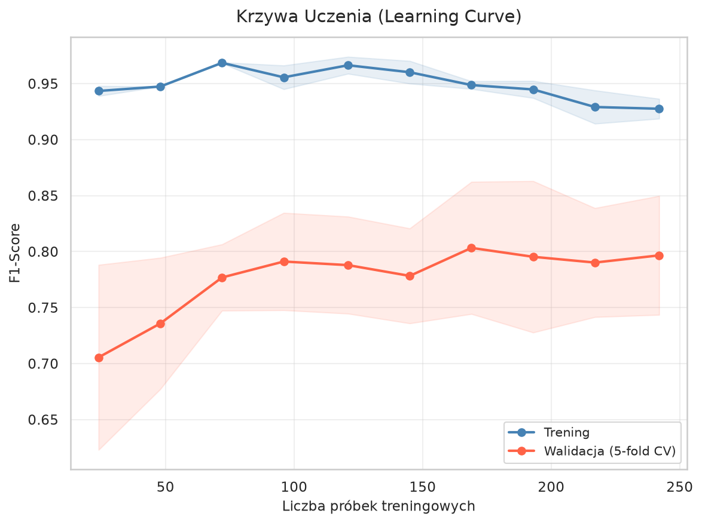
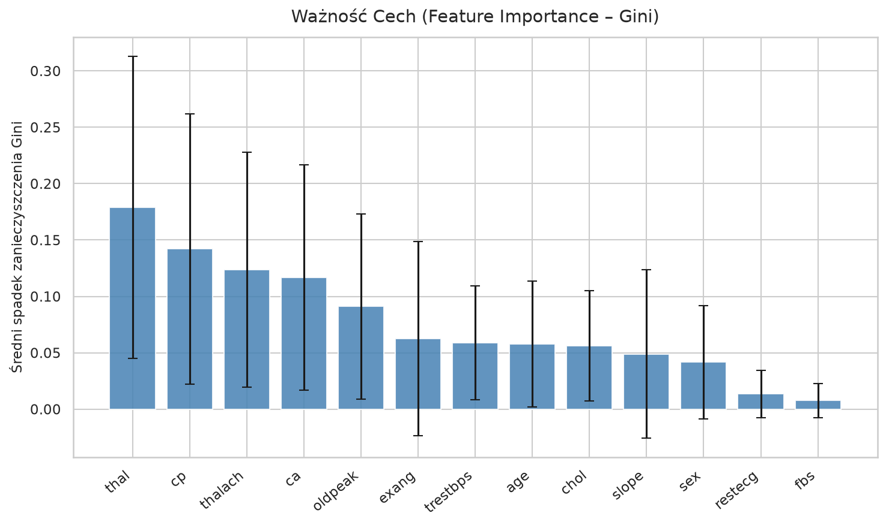
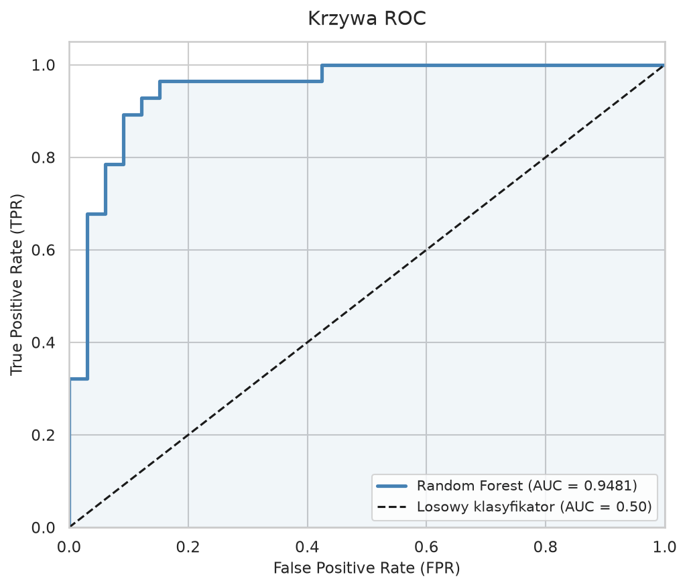
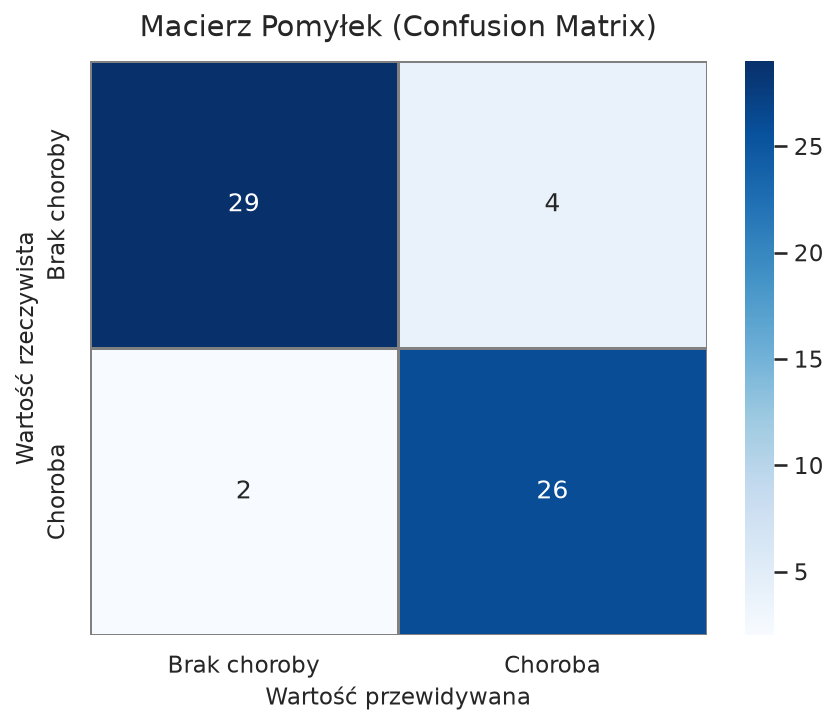

# Uczenie Maszynowe – Projekt: Las Losowy (Random Forest)

> **Zadanie:** Zaimplementować model uczenia maszynowego oparty na algorytmie **lasu losowego**, wytrenować go na rzeczywistych danych i ocenić skuteczność za pomocą **trzech metryk** (poza accuracy).

---

## Spis treści

1. [Opis projektu](#1-opis-projektu)
2. [Zbiór danych](#2-zbiór-danych)
3. [Struktura repozytorium](#3-struktura-repozytorium)
4. [Plan realizacji](#4-plan-realizacji)
5. [Metryki oceny modelu](#5-metryki-oceny-modelu)
6. [Technologie](#6-technologie)
7. [Jak uruchomić](#7-jak-uruchomić)
8. [Wyniki](#8-wyniki)

---

## 1. Opis projektu

Projekt polega na zbudowaniu klasyfikatora binarnego do **przewidywania choroby serca** u pacjentów. Użyty algorytm to **Random Forest (Las Losowy)** – metoda ensemble bazująca na zbiorze drzew decyzyjnych.

**Cel:** Przewidzieć, czy pacjent ma chorobę serca (`1`) czy nie (`0`) na podstawie danych klinicznych.

---

## 2. Zbiór danych

**Dataset:** [Heart Disease UCI](https://archive.ics.uci.edu/dataset/45/heart+disease) – zbiór Cleveland z repozytorium UCI Machine Learning Repository.

| Właściwość       | Wartość                         |
|------------------|---------------------------------|
| Liczba próbek    | 303                             |
| Liczba cech      | 13 cech wejściowych             |
| Zmienna docelowa | `target` – 0 (brak) / 1 (choroba) |
| Typ problemu     | Klasyfikacja binarna            |

**Cechy (features):**

| Cecha      | Opis                                          | Typ       |
|------------|-----------------------------------------------|-----------|
| `age`      | Wiek pacjenta                                 | numeryczna |
| `sex`      | Płeć (0 = kobieta, 1 = mężczyzna)            | kategoryczna |
| `cp`       | Typ bólu w klatce piersiowej (0–3)            | kategoryczna |
| `trestbps` | Ciśnienie krwi w spoczynku [mm Hg]            | numeryczna |
| `chol`     | Poziom cholesterolu [mg/dl]                   | numeryczna |
| `fbs`      | Cukier na czczo > 120 mg/dl (0/1)             | kategoryczna |
| `restecg`  | Wyniki EKG w spoczynku (0–2)                  | kategoryczna |
| `thalach`  | Maksymalne tętno                              | numeryczna |
| `exang`    | Dławica wywołana wysiłkiem (0/1)              | kategoryczna |
| `oldpeak`  | Obniżenie ST (wysiłek vs spoczynek)           | numeryczna |
| `slope`    | Nachylenie segmentu ST (0–2)                  | kategoryczna |
| `ca`       | Liczba naczyń (0–3) w fluoroskopii            | numeryczna |
| `thal`     | Wynik testu talusowego (0–3)                  | kategoryczna |

---

## 3. Struktura repozytorium

```
Uczenie-Maszynowe-Projekt/
│
├── data/
│   └── heart.csv                   # Zbiór danych
│
├── notebooks/
│   ├── 01_eda.ipynb                # Eksploracyjna analiza danych (EDA)
│   └── 02_model_training.ipynb    # Trening i ewaluacja modelu
│
├── src/
│   ├── preprocessing.py            # Wczytanie i przygotowanie danych
│   ├── model.py                    # Definicja i trening modelu RF
│   └── evaluation.py               # Obliczanie metryk i wizualizacje
│
├── plots/
│   ├── confusion_matrix.png        # Macierz pomyłek
│   ├── roc_curve.png               # Krzywa ROC
│   ├── feature_importance.png      # Ważność cech
│   └── learning_curve.png          # Krzywa uczenia
│
├── main.py                         # Główny skrypt – pełny pipeline
├── requirements.txt                # Zależności Python
└── README.md
```

---

## 4. Plan realizacji

### Krok 1 – Wczytanie i eksploracja danych (EDA)

- Wczytanie datasetu (`pandas`)
- Sprawdzenie brakujących wartości
- Statystyki opisowe (`.describe()`)
- Rozkład klas (`target`: 0 vs 1)
- Macierz korelacji (heatmapa)
- Histogramy i boxploty dla cech numerycznych
- Wykresy słupkowe dla cech kategorycznych

### Krok 2 – Przygotowanie danych (Preprocessing)

- Sprawdzenie i uzupełnienie brakujących wartości (jeśli są)
- Kodowanie cech kategorycznych (`pd.get_dummies` lub `LabelEncoder`)
- Podział na zbiór treningowy i testowy: **80% / 20%** (`train_test_split`)
- Standaryzacja cech numerycznych (`StandardScaler`) – opcjonalna dla RF, ale dobra praktyka

```python
from sklearn.model_selection import train_test_split
from sklearn.preprocessing import StandardScaler

X_train, X_test, y_train, y_test = train_test_split(
    X, y, test_size=0.2, random_state=42, stratify=y
)
```

### Krok 3 – Trening modelu Random Forest

- Inicjalizacja `RandomForestClassifier` z domyślnymi parametrami
- Trenowanie na zbiorze treningowym
- Optymalizacja hiperparametrów: **GridSearchCV** (5-fold cross-validation)

**Hiperparametry do strojenia:**

| Parametr           | Przeszukiwane wartości       | Opis                            |
|--------------------|------------------------------|---------------------------------|
| `n_estimators`     | [100, 200, 300]              | Liczba drzew w lesie            |
| `max_depth`        | [None, 5, 10, 15]            | Maksymalna głębokość drzewa     |
| `min_samples_split`| [2, 5, 10]                   | Min. próbek do podziału węzła   |
| `min_samples_leaf` | [1, 2, 4]                    | Min. próbek w liściu            |
| `max_features`     | ['sqrt', 'log2']             | Liczba cech do rozważenia       |

```python
from sklearn.ensemble import RandomForestClassifier
from sklearn.model_selection import GridSearchCV

param_grid = {
    'n_estimators': [100, 200, 300],
    'max_depth': [None, 5, 10, 15],
    'min_samples_split': [2, 5, 10],
    'max_features': ['sqrt', 'log2']
}

rf = RandomForestClassifier(random_state=42)
grid_search = GridSearchCV(rf, param_grid, cv=5, scoring='f1', n_jobs=-1)
grid_search.fit(X_train, y_train)
best_model = grid_search.best_estimator_
```

### Krok 4 – Ewaluacja modelu

- Predykcja na zbiorze testowym
- Obliczenie **accuracy** oraz **3 dodatkowych metryk** (patrz sekcja 5)
- Macierz pomyłek (Confusion Matrix)
- Krzywa ROC i pole pod krzywą (AUC)
- Analiza ważności cech (`feature_importances_`)
- Krzywa uczenia (Learning Curve) – diagnoza over/underfitting

### Krok 5 – Wizualizacje i wnioski

- Zestawienie metryk w tabeli
- Porównanie modelu z/bez tuningu
- Interpretacja wyników: które cechy mają największy wpływ na diagnozę?
- Wnioski końcowe

---

## 5. Metryki oceny modelu

Poza **accuracy** używamy trzech metryk, które lepiej opisują jakość klasyfikatora – szczególnie przy niezbalansowanych klasach:

---

### Metryka 1: F1-Score

**Wzór:**

$$F1 = 2 \cdot \frac{\text{Precision} \times \text{Recall}}{\text{Precision} + \text{Recall}}$$

**Dlaczego?** F1-Score jest harmoniczną średnią precyzji i czułości. Karze mocno za zarówno fałszywe pozytywy, jak i fałszywe negatywy. W diagnozie medycznej kluczowe jest wykrycie **wszystkich chorych** (wysoki Recall) i nie diagnozowanie zdrowych jako chorych (wysoka Precision) – F1 balansuje oba aspekty.

**Interpretacja:** Wartość od 0 do 1. Im bliżej 1, tym lepiej.

```python
from sklearn.metrics import f1_score
f1 = f1_score(y_test, y_pred)
```

---

### Metryka 2: ROC-AUC (Area Under the ROC Curve)

**Opis:** ROC-AUC mierzy zdolność modelu do **odróżniania klas** przy różnych progach klasyfikacji. Krzywa ROC pokazuje stosunek TPR (czułość) do FPR (1 - specyficzność).

**Wzór AUC:** Pole pod krzywą ROC (całkowane po trapezy).

**Dlaczego?** AUC jest odporne na niezbalansowanie klas i mierzy ogólną zdolność dyskryminacyjną modelu – nie zależy od konkretnego progu 0.5.

**Interpretacja:**
- AUC = 0.5 → model losowy
- AUC = 1.0 → model doskonały
- AUC ≥ 0.8 → dobra jakość modelu

```python
from sklearn.metrics import roc_auc_score
auc = roc_auc_score(y_test, model.predict_proba(X_test)[:, 1])
```

---

### Metryka 3: Matthews Correlation Coefficient (MCC)

**Wzór:**

$$MCC = \frac{TP \cdot TN - FP \cdot FN}{\sqrt{(TP+FP)(TP+FN)(TN+FP)(TN+FN)}}$$

**Dlaczego?** MCC jest uważany za jedną z najlepszych pojedynczych metryk dla klasyfikacji binarnej – uwzględnia **wszystkie cztery komórki macierzy pomyłek** (TP, TN, FP, FN). Jest szczególnie cenny przy niezbalansowanych zbiorach danych. W przeciwieństwie do accuracy, nie jest mylący gdy klasy są nierówne.

**Interpretacja:**
- MCC = -1 → model odwrotny (zawsze się myli)
- MCC = 0 → predykcja losowa
- MCC = +1 → model doskonały

```python
from sklearn.metrics import matthews_corrcoef
mcc = matthews_corrcoef(y_test, y_pred)
```

---

### Podsumowanie metryk

| Metryka        | Zakres  | Zaleta                                    |
|----------------|---------|-------------------------------------------|
| **Accuracy**   | [0, 1]  | Prosta interpretacja                      |
| **F1-Score**   | [0, 1]  | Balans Precision/Recall                   |
| **ROC-AUC**    | [0, 1]  | Niezależna od progu, odporna na imbalance |
| **MCC**        | [-1, 1] | Uwzględnia wszystkie komórki CM           |

---

## 6. Technologie

| Biblioteka       | Wersja      | Zastosowanie                        |
|------------------|-------------|-------------------------------------|
| Python           | ≥ 3.10      | Język programowania                 |
| pandas           | ≥ 2.0       | Manipulacja danymi                  |
| numpy            | ≥ 1.24      | Operacje numeryczne                 |
| scikit-learn     | ≥ 1.3       | Model RF, metryki, walidacja        |
| matplotlib       | ≥ 3.7       | Podstawowe wykresy                  |
| seaborn          | ≥ 0.12      | Estetyczne wizualizacje             |
| jupyter          | ≥ 1.0       | Notebooki                           |

---

## 7. Jak uruchomić

### Instalacja zależności

```bash
pip install -r requirements.txt
```

### Uruchomienie głównego skryptu

```bash
python main.py
```

### Uruchomienie notebooków

```bash
jupyter notebook notebooks/
```

Najpierw `01_eda.ipynb`, potem `02_model_training.ipynb`.

---

## 8. Wyniki

|Metryka    | Bazowy RF| Strojony RF|
|-----------|----------|------------|
|Accuracy   | 0.8852   | 0.9016     |
|F1-Score   | 0.8852   | 0.8966     |
|ROC-AUC    | 0.9513   | 0.9481     |
|MCC        | 0.7825   | 0.8048     |

- **Las losowy** osiągnął dobre wyniki predykcji choroby serca

- **GridSearchCV** z 5-fold cross-validation pozwolił znaleźć optymalne hiperparametry

- **F1-Score** jest tu szczególnie ważny – równoważny balans między wykrywaniem chorych a unikaniem fałszywych alarmów
- **ROC-AUC > 0.85** wskazuje na dobrą zdolność rozróżniania klas przy różnych progach

- **MCC** potwierdza jakość modelu uwzględniając wszystkie 4 komórki macierzy pomyłek

- Najważniejsze cechy predykcyjne: `thal`, `cp`, `ca`, `oldpeak`, `thalach`

---

## Autorzy
- Oskar Chrostowski
- Kajetan Mieloch
- Kacper Wiszniewski
- Michał Nowakowski
- Paweł Szydłowski

Projekt realizowany w ramach przedmiotu **Uczenie Maszynowe** na studiach.
